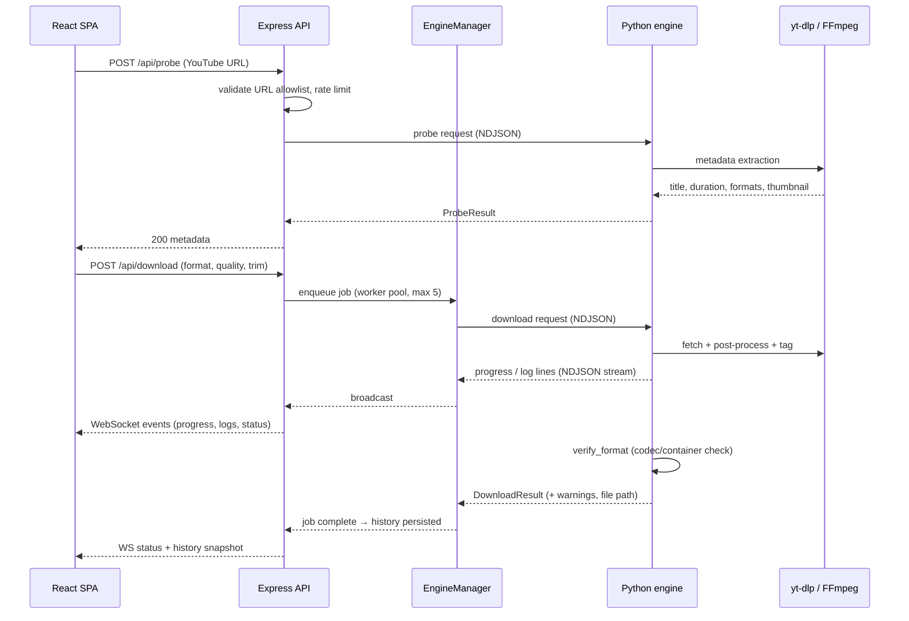

# YTDL Flow — Architecture

> Deep technical reference: `docs/codebase/ARCHITECTURE.md` (layers, patterns),
> `docs/codebase/STACK.md` (versions), `docs/codebase/CONCERNS.md` (known gaps).
> This file is the canonical overview.

## Three tiers

YTDL Flow is a strict three-tier localhost application. Each tier owns a clear
responsibility and communicates with its neighbor over an explicit contract.

```
Browser
  ↓
React SPA (Vite build, TypeScript, Zustand)
  ↓
REST + WebSocket (localhost-only, origin-checked)
  ↓
Node.js / Express server (security, queue, history, engine lifecycle)
  ↓
Python IPC (NDJSON over stdio)
  ↓
Python engine (engine.py + ipc_main.py)
  ↓
yt-dlp  ·  FFmpeg  ·  mutagen
```

## End-to-end download flow



## Frontend (`src/`)

- **React 19 + TypeScript** SPA built with Vite; entry `src/main.tsx`,
  composition in `src/App.tsx`.
- **State:** Zustand store (`src/stores/downloadStore.ts`) with optimistic UI
  state, probe-in-flight guard, and job restore on mount.
- **Events:** `src/hooks/useEngineEvents.ts` consumes WebSocket events with a
  terminal-result guard (cancelled rows are never overwritten).
- **API access:** `src/api/transport.ts` — the only fetch/WS client; origin and
  URL handling shared with the server via `src/components/urlRegex.ts` parity
  tests.
- **Components:** header, URL input, confirm dialog, metadata panel, queue,
  log panel (pinned auto-scroll), history drawer, error boundary.
- Dark-only theme defined by CSS-first Tailwind v4 `@theme` tokens in
  `src/styles.css` (see `docs/design-system.md`).

## Node.js server (`web/`)

- **Plain ESM `.mjs`** (deliberately no TypeScript) on Express 5.
- **Entrypoint:** `web/server.mjs` — binds `127.0.0.1` only; prints a startup
  banner; wires routes and middleware.
- **Routes (`web/routes/`):** probe, download (with trim params), cancel,
  history, health/status.
- **Middleware (`web/middleware/`):**
  - `static.mjs` — serves the built SPA with a strict CSP and `no-store`-style
    cache headers on app shell; renders a branded placeholder page when no
    build exists.
  - WebSocket origin validation (`ws-origin`) + Host header checks.
  - Rate limiting on API endpoints.
- **Services (`web/services/`):**
  - `engineManager.mjs` — owns the Python child process, NDJSON framing,
    request/response correlation, recover() on terminal `EngineRestarted`
    errors, engine restart policy.
  - `historyService.mjs` + `historyPersistence.mjs` — JSON-file history
    (`web/data/history.json`) with atomic temp-file + rename writes and
    server-side persistence across restarts.

## Python engine (`python-engine/`)

- `ipc_main.py` — stdio entrypoint: reads NDJSON requests, threads results
  (including `warnings`) back on the wire; enriches job snapshots.
- `engine.py` — download orchestration: yt-dlp invocation with multi-client
  strategies, progress/log forwarding, pre-existing-file collision retry with
  id-suffixed template, `verify_format` output validation, engine probe
  (ffmpeg discovery) with watchdog, trim threading.
- `helpers.py` / `logger.py` — shared utilities and log collection (captures
  yt-dlp's own markers, including "has already been downloaded").
- Depends on pinned, hash-locked `yt-dlp` + `mutagen`
  (`requirements.lock`); FFmpeg/ffprobe as external binaries (auto-detected,
  optional `FFMPEG_PATH`).

## Storage & persistence

| Data | Where | Mechanism |
|------|-------|-----------|
| Downloads | `web/data/downloads/` | yt-dlp output, metadata-embedded files |
| History | `web/data/history.json` | JSON file, atomic write (temp + rename) |
| Engine state | in-memory (Node) | rebuilt/reported via status API |

## Worker pool & queue

The server enqueues validated download requests into a bounded worker pool
(max 5 concurrent). Each worker drives one engine request to completion; jobs
expose state transitions (`queued → downloading → processing → done/error`)
broadcast over WebSocket. Cancellation is cooperative; cancelled results are
guarded client-side.

## Security posture (summary)

- localhost-only binding; Host header validation; WS origin checks
- strict CSP on served pages (including IPv6 loopback `connect-src`)
- URL allowlisting (YouTube-only) shared regex parity between client and server
- rate limiting; input validation (`web/validate.mjs`)
- pinned dependencies (`requirements.lock`, npm lockfiles); CI audits

Details: `docs/codebase/CONCERNS.md` and README "Security Considerations".
